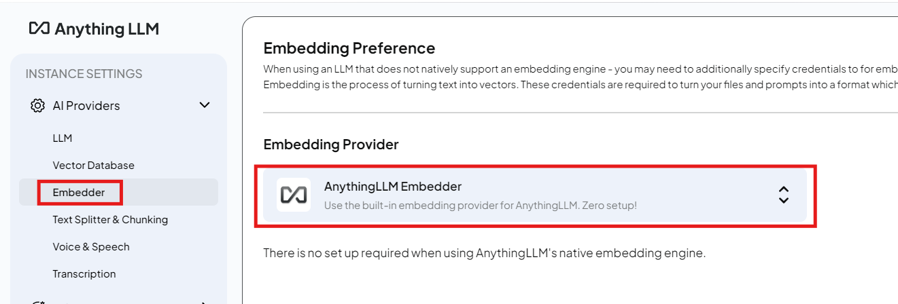

# LocalRAG

**Simple and easy local RAG (Retrieval-Augmented Generation) guide** you can set up to run your local LLMs for free.

- [LocalRAG](#localrag)
  - [Guide](#guide)
    - [System Requirements](#system-requirements)
    - [Guide 1 Run Local RAG Using Anythingllm and OpenRouter](#guide-1-run-local-rag-using-anythingllm-and-openrouter)
      - [1 Install Anythingllm](#1-install-anythingllm)
      - [2 Generate API Keys for OpenRouter](#2-generate-api-keys-for-openrouter)
      - [3 Launch AnythingLLM and configure to make use of OpenRouter](#3-launch-anythingllm-and-configure-to-make-use-of-openrouter)
      - [4 Create Workspace](#4-create-workspace)
      - [5 Set Up Vector Database and embed your documents into your RAG](#5-set-up-vector-database-and-embed-your-documents-into-your-rag)
      - [6 Upload your documents and build your knowledge base](#6-upload-your-documents-and-build-your-knowledge-base)
      - [7 (Optional) Configure as query mode](#7-optional-configure-as-query-mode)
      - [8 Test the RAG System](#8-test-the-rag-system)
    - [Guide 2 Run Local RAG Using Anythingllm and Self hosted Chat LLM Using LMStudio](#guide-2-run-local-rag-using-anythingllm-and-self-hosted-chat-llm-using-lmstudio)
  - [Links](#links)
  - [Models that work for NVIDIA RTX4080 GPU](#models-that-work-for-nvidia-rtx4080-gpu)

## Guide

### System Requirements

This guide was tested with the following system specs

- Windows 11
- NVIDIA RTC 4080
- 16GB RAM
- Processor	Intel(R) Core(TM) i7-14650HX, 2200 Mhz, 16 Core(s), 24 Logical Processor(s)
- NVIDIA GeForce RTX 4080 Laptop GPU

### Guide 1 Run Local RAG Using Anythingllm and OpenRouter

Guide based on **AnythingLLM v1.8.2**

#### 1 Install Anythingllm

- (recommended) Download the latest AnythinLLM version from here https://anythingllm.com/

#### 2 Generate API Keys for OpenRouter

Open router provides use access to a wide range of free LLMs developed from the majority of the big players (OpenAI, META, Google, Grok and more)

1. Head to https://openrouter.ai and sign up and confirm email
2. Head to https://openrouter.ai/settings/keys and generate key

#### 3 Launch AnythingLLM and configure to make use of OpenRouter

1. Head to settings -> AI Providers -> LLMs
2. Select OpenRouter and set API Key

3. Select a model marked as free
   1. In this example I have user **meta-llama/llama-4-maverick:free** but other excellent choices are also
      1. mistralai/mistral-small-3.1-24b-instruct:free
      2. deepseek/deepseek-r1-distill-llama-70b:free
      3. apidog.com+14gaikarkshitij.medium.com+14reddit.com+14
      4. reddit.com+9ollama.hf-mirror.com+9

#### 4 Create Workspace

Now that you have added the LLM you should be able to start chatting wright away.

1. Create a work space

#### 5 Set Up Vector Database and embed your documents into your RAG

    This is the most important step of the RAG system, embedding your documents into a vector database. By embedding your documents you are generating essentially an array of numbers (relations) from each document you upload. Similar document generate similar arrays of numbers and are hence grouped/linked/related more than others. The vector database serves as the knowledge base for your LLM (any LLM you plan to use will make use of this database, so you can switch between LLMs).

    We have 2 machine learning models that we require, 1 for producing the vector database/knowledge base and one for chatting and providing information from this vector database/knowledge base.

1. Set up vector database (for local set up default option works fine)

2. Select an Embedding LLM (for local set up default option works fine). 

 
**Also some other options**

| Model/API                           | Dim  | Free?                        | API Option                   | Notes                             |
| ----------------------------------- | ---- | ---------------------------- | ---------------------------- | --------------------------------- |
| **Cohere/embed-english-light-v3.0** | 1024 | ✅ 1M tokens/month            | [Cohere](https://cohere.com) | Fast, accurate, multilingual      |
| **OpenAI/text-embedding-3-small**   | 1536 | ❌ after limit                | OpenAI                       | Great but paid                    |
| **Mistral Embed**                   | 1024 | ✅ via Together.ai/OpenRouter | OpenRouter                   | Lightweight, decent for chatbots  |
| **BAAI/bge-base-en-v1.5**           | 768  | ✅ HF / Local                 | HuggingFace, Ollama          | Strong multilingual support       |
| **DeepSeek Embed**                  | 1024 | ✅ via OpenRouter             | OpenRouter                   | Matches DeepSeek-R AG pipelines   |
| **InstructorXL**                    | 768  | ✅ HuggingFace                | HuggingFace Spaces           | Instruction-based embedding model |

#### 6 Upload your documents and build your knowledge base

You may upload images, pdfs, text files and etc to build your knowledge base

1. Head to the home screen and click on embed a document

2. Upload your documents and assign them to your workspace

#### 7 (Optional) Configure as query mode

1. Click on your works space settings and change to query mode

#### 8 Test the RAG System

### Guide 2 Run Local RAG Using Anythingllm and Self hosted Chat LLM Using LMStudio

- Coming Soon

## Links
- lmstudio
  - attempt https://lmstudio.ai/docs/typescript in a client app project https://github.com/lmstudio-ai/lmstudio-js
  - https://hub.docker.com/r/noneabove1182/lmstudio-cuda
- anythingllm
  - https://github.com/Mintplex-Labs/anything-llm
  - https://hub.docker.com/r/mintplexlabs/anythingllm
  - https://www.youtube.com/@TimCarambat
- https://github.com/mudler/LocalAI

## Models that work for NVIDIA RTX4080 GPU

| Model                       | Size     | Notes                             |
| --------------------------- | -------- | --------------------------------- |
| **TinyLLaMA (1.1B)**        | 1.1B     | Great for testing, good trade-off |
| **LiteLLaMA (460M)**        | 460M     | Ultra-light for toy use           |
| **MobileLLaMA (1.4B/2.7B)** | 1.4–2.7B | Fast for real-time apps           |
| **Phi‑3‑mini (3.8B)**       | 3.8B     | Benchmarks rival larger models    |
| **Llama 3.1‑Minitron (4B)** | 4B       | Distilled, high efficiency        |

